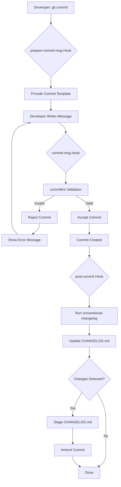

# Automated Changelog System - Technical Architecture

## Overview

This document provides a comprehensive technical explanation of how the automated changelog system works, from Git hooks to changelog generation. This is intended for developers who need to understand, maintain, or extend the system.

## System Architecture



## Component Breakdown

### 1. Husky - Git Hooks Manager

**Location:** `/.husky/` (at git repository root)

**What it does:**
- Manages Git hooks as executable shell scripts
- Intercepts Git operations at specific lifecycle points
- Easier to version control than native `.git/hooks`

**Configuration:**
```json
// package.json
{
  "scripts": {
    "prepare": "husky"
  }
}
```

**How it works:**
1. `npm install` runs the `prepare` script
2. Husky configures Git to use `.husky` directory for hooks
3. Git runs: `git config core.hooksPath ".husky"`
4. All hooks in `.husky/` become active

**Why at repository root?**
- Git hooks must be at the same level as `.git` directory
- This project structure has workspace nested inside repo
- Hooks navigate to workspace before running npm commands

### 2. Git Hook: prepare-commit-msg

**File:** `/.husky/prepare-commit-msg`

**When it runs:** Before the commit message editor opens

**Purpose:** Provide a helpful template for developers

**Implementation:**
```bash
#!/bin/sh
COMMIT_MSG_FILE=$1
COMMIT_SOURCE=$2

# Only add template for new commits (not amends, merges, etc.)
if [ -z "$COMMIT_SOURCE" ]; then
  if ! grep -q '[a-zA-Z]' "$COMMIT_MSG_FILE"; then
    cat > "$COMMIT_MSG_FILE" << 'EOF'
# <type>(<scope>): <subject>
# ...template content...
EOF
  fi
fi
```

**Key Points:**
- Runs BEFORE user writes message
- Only activates for new commits (not `git commit --amend`)
- Checks if message file is empty before adding template
- Comments are stripped by Git automatically

**Arguments:**
- `$1` - Path to commit message file (`.git/COMMIT_EDITMSG`)
- `$2` - Commit source (empty for new commits, "message" for `-m`, "merge" for merges)

### 3. Git Hook: commit-msg

**File:** `/.husky/commit-msg`

**When it runs:** After message is written, before commit is created

**Purpose:** Validate commit message format

**Implementation:**
```bash
#!/bin/sh
cd "Intro to AI  for Web Developers"
npx --no -- commitlint --edit "$1"
```

**How it works:**

1. **Navigate to workspace:**
   - Hook runs at repo root
   - Must `cd` to find `node_modules` and `package.json`

2. **Execute commitlint:**
   - `npx --no` - Run without installing (use existing package)
   - `commitlint --edit "$1"` - Validate file at path `$1`

3. **Exit code determines outcome:**
   - `0` - Valid, commit proceeds
   - `Non-zero` - Invalid, commit rejected

**Arguments:**
- `$1` - Path to commit message file

**Validation Process:**
```javascript
// commitlint reads .commitlintrc.json
{
  "extends": ["@commitlint/config-conventional"],
  "rules": {
    "type-enum": [2, "always", ["feat", "fix", "docs", ...]],
    "subject-empty": [2, "never"],
    // ... more rules
  }
}
```

**Error Levels:**
- `0` - Disabled
- `1` - Warning (doesn't fail)
- `2` - Error (fails commit)

### 4. Commitlint - Message Validator

**Package:** `@commitlint/cli` + `@commitlint/config-conventional`

**Configuration:** `.commitlintrc.json`

**What it validates:**

| Rule | Description | Example |
|------|-------------|---------|
| `type-enum` | Type must be in allowed list | `feat`, `fix`, `docs` ✅ / `feature` ❌ |
| `type-empty` | Type is required | `feat: add` ✅ / `: add` ❌ |
| `type-case` | Type must be lowercase | `feat` ✅ / `Feat` ❌ |
| `subject-empty` | Subject is required | `feat: add feature` ✅ / `feat:` ❌ |
| `subject-full-stop` | Subject can't end with period | `feat: add feature` ✅ / `feat: add feature.` ❌ |
| `subject-case` | Subject case rules | `feat: add feature` ✅ / `feat: Add feature` ❌ |

**Parsing Algorithm:**

```javascript
// Input: "feat(scope): add new feature"

// 1. Extract type
const type = message.match(/^(\w+)/)[1]; // "feat"

// 2. Extract scope (optional)
const scope = message.match(/\(([^)]+)\)/)?.[1]; // "scope"

// 3. Extract subject
const subject = message.match(/:\s*(.+)$/)[1]; // "add new feature"

// 4. Validate each component
validateType(type);      // Check against enum
validateScope(scope);    // Check format
validateSubject(subject); // Check case, length, etc.
```

### 5. Git Hook: post-commit

**File:** `/.husky/post-commit`

**When it runs:** After commit is successfully created

**Purpose:** Automatically update CHANGELOG.md

**Implementation:**
```bash
#!/bin/sh
cd "Intro to AI  for Web Developers"

# Generate changelog from commit history
npm run changelog --silent

# Stage the updated changelog if it changed
if [ -n "$(git status --porcelain CHANGELOG.md)" ]; then
  git add CHANGELOG.md
  git commit --amend --no-edit --no-verify
fi
```

**How it works:**

1. **Generate Changelog:**
   - Runs `conventional-changelog` via npm script
   - Parses commit history for conventional commits
   - Updates `CHANGELOG.md` with new entries

2. **Check for Changes:**
   - `git status --porcelain CHANGELOG.md` outputs changes
   - `-n` checks if output is non-empty (file changed)

3. **Amend Commit:**
   - `git add CHANGELOG.md` - Stage the updated file
   - `git commit --amend` - Add to previous commit
   - `--no-edit` - Keep same commit message
   - `--no-verify` - Skip hooks (prevent infinite loop)

**Important:** `--no-verify` prevents triggering hooks again, which would cause infinite recursion.

### 6. Conventional Changelog - Generator

**Package:** `conventional-changelog-cli`

**Command:** `conventional-changelog -p angular -i CHANGELOG.md -s`

**Arguments Explained:**
- `-p angular` - Use Angular commit convention preset
- `-i CHANGELOG.md` - Input/output file (read and update)
- `-s` - Same file mode (prepend to existing file)
- `-r 0` - (In reset mode) Regenerate entire changelog from all commits

**How It Works:**

```javascript
// 1. Read git log
const commits = execSync('git log --format="%H|%s|%b"').toString();

// 2. Parse commits
commits.forEach(commit => {
  const parsed = parseCommit(commit);
  
  // 3. Filter by convention
  if (isConventional(parsed)) {
    // 4. Categorize by type
    if (parsed.type === 'feat') features.push(parsed);
    if (parsed.type === 'fix') fixes.push(parsed);
    // ... etc
  }
});

// 5. Generate markdown
const markdown = generateMarkdown({
  version: getVersion(),
  date: new Date().toISOString(),
  features,
  fixes,
  // ... other categories
});

// 6. Prepend to CHANGELOG.md
const existing = fs.readFileSync('CHANGELOG.md');
fs.writeFileSync('CHANGELOG.md', markdown + '\n\n' + existing);
```

**Output Format:**

```markdown
## 0.0.0 (2025-12-10)

### Features

* **scope:** feature description ([commit](link))
* **scope:** another feature ([commit](link))

### Bug Fixes

* **scope:** fix description ([commit](link))
```

**Preset Types Mapping:**

| Type | Section | Icon |
|------|---------|------|
| `feat` | Features | ✨ |
| `fix` | Bug Fixes | 🐛 |
| `docs` | Documentation | 📝 |
| `style` | Styles | 💄 |
| `refactor` | Code Refactoring | ♻️ |
| `perf` | Performance Improvements | ⚡ |
| `test` | Tests | ✅ |
| `build` | Build System | 🏗️ |
| `ci` | Continuous Integration | 👷 |
| `chore` | Chores | 🔧 |

### 7. Complete Execution Flow

#### Scenario 1: Valid Commit

```bash
$ git commit -m "feat(todos): add dark mode toggle"

# 1. commit-msg hook runs
→ commitlint validates message
→ Returns exit code 0 (success)

# 2. Git creates commit
→ Commit hash: abc123
→ Commit object stored in .git/objects/

# 3. post-commit hook runs
→ cd "Intro to AI  for Web Developers"
→ npm run changelog
  → conventional-changelog parses git log
  → Finds new commit: "feat(todos): add dark mode toggle"
  → Generates entry:
    * **todos:** add dark mode toggle ([abc123](link))
  → Prepends to CHANGELOG.md

# 4. Check if CHANGELOG.md changed
→ git status --porcelain CHANGELOG.md
→ Output: " M CHANGELOG.md"
→ Non-empty, so proceed

# 5. Amend commit with changelog
→ git add CHANGELOG.md
→ git commit --amend --no-edit --no-verify
  → Adds CHANGELOG.md to commit
  → Keeps same message
  → Skips hooks (--no-verify)

# 6. Final commit includes:
→ Original changes
→ Updated CHANGELOG.md
→ Same commit message
```

#### Scenario 2: Invalid Commit

```bash
$ git commit -m "Added new feature"

# 1. commit-msg hook runs
→ commitlint validates message
→ Finds errors:
  ✖ type may not be empty [type-empty]
→ Returns exit code 1 (failure)

# 2. Git rejects commit
→ Commit is NOT created
→ Changes remain staged
→ Working directory unchanged

# 3. Developer sees error
✖ found 1 problems, 0 warnings

# 4. Developer fixes and retries
$ git commit -m "feat: add new feature"
→ Validation passes
→ Commit proceeds
```

## Directory Structure

```
/Users/m1promachine2022/code/AIDD/
├── .git/                           # Git repository (auto-configures hooks)
├── .husky/                         # Git hooks directory
│   ├── commit-msg                  # Validate commit message
│   ├── post-commit                 # Generate changelog
│   └── prepare-commit-msg          # Provide template
│
└── Intro to AI  for Web Developers/  # Workspace directory
    ├── .commitlintrc.json          # Commitlint configuration
    ├── CHANGELOG.md                # Auto-generated changelog
    ├── package.json                # Scripts and dependencies
    │   └── scripts:
    │       ├── prepare: "husky"
    │       ├── changelog: "conventional-changelog -p angular -i CHANGELOG.md -s"
    │       └── changelog:reset: "conventional-changelog -p angular -i CHANGELOG.md -s -r 0"
    │
    ├── node_modules/
    │   ├── husky/
    │   ├── commitlint/
    │   └── conventional-changelog-cli/
    │
    └── .claude/commands/
        ├── commits.md              # User guide
        ├── changelog-architecture.md  # This file
        └── workflow-test-results.md   # Test documentation
```

## Configuration Deep Dive

### .commitlintrc.json

```json
{
  "extends": ["@commitlint/config-conventional"],
  "rules": {
    // Type must be in this list
    "type-enum": [
      2,        // Error level (2 = error, fails commit)
      "always", // When to apply (always check)
      [         // Allowed values
        "feat", "fix", "docs", "style", "refactor",
        "perf", "test", "build", "ci", "chore", "revert"
      ]
    ],
    
    // Subject must not be in sentence-case (capitalized)
    "subject-case": [2, "never", ["upper-case"]],
    
    // Subject must not be empty
    "subject-empty": [2, "never"],
    
    // Subject must not end with period
    "subject-full-stop": [2, "never", "."],
    
    // Type must be lowercase
    "type-case": [2, "always", "lower-case"],
    
    // Type must not be empty
    "type-empty": [2, "never"]
  }
}
```

**Rule Format:** `[level, applicable, value]`

- **Level:** 0 (disabled), 1 (warning), 2 (error)
- **Applicable:** "always" or "never"
- **Value:** Expected value or array of options

### package.json Scripts

```json
{
  "scripts": {
    // Run automatically on npm install
    "prepare": "husky",
    
    // Update changelog with latest commits
    "changelog": "conventional-changelog -p angular -i CHANGELOG.md -s",
    
    // Regenerate entire changelog from all commits
    "changelog:reset": "conventional-changelog -p angular -i CHANGELOG.md -s -r 0"
  }
}
```

## Troubleshooting the System

### Hook Not Running

**Symptom:** Commits succeed without validation

**Diagnosis:**
```bash
# Check hooks path configuration
git config core.hooksPath
# Should output: .husky

# Check hook file exists
ls -la .husky/commit-msg

# Check hook is executable
ls -l .husky/commit-msg
# Should start with: -rwxr-xr-x
```

**Fix:**
```bash
# Reconfigure hooks path
cd /path/to/git/root
git config core.hooksPath ".husky"

# Make hooks executable
chmod +x .husky/*
```

### Commitlint Not Found

**Symptom:** `npx: command not found` or `commitlint: command not found`

**Diagnosis:**
```bash
# Check if package is installed
ls node_modules/@commitlint/cli

# Check if npx is available
which npx
```

**Fix:**
```bash
# Reinstall dependencies
npm install

# Or install commitlint specifically
npm install --save-dev @commitlint/cli @commitlint/config-conventional
```

### Changelog Not Updating

**Symptom:** Commits succeed but CHANGELOG.md doesn't change

**Diagnosis:**
```bash
# Check if post-commit hook exists
ls -la .husky/post-commit

# Manually run changelog generation
npm run changelog

# Check git status
git status CHANGELOG.md
```

**Possible Causes:**
1. Hook not executable: `chmod +x .husky/post-commit`
2. npm command fails: Check `npm run changelog` output
3. No conventional commits: Only conventional format generates entries
4. Wrong directory: Hook must `cd` to workspace

### Infinite Loop (Post-commit)

**Symptom:** Git hangs or crashes during commit

**Cause:** Post-commit hook triggers another commit without `--no-verify`

**Fix:** Ensure post-commit uses `--no-verify`:
```bash
git commit --amend --no-edit --no-verify
```

### Permission Errors

**Symptom:** `EPERM: operation not permitted`

**Cause:** Sandbox restrictions on file operations

**Fix:** Run with appropriate permissions or use `--no-verify` to skip hooks temporarily

## Extending the System

### Add Custom Commit Types

1. Edit `.commitlintrc.json`:
```json
{
  "rules": {
    "type-enum": [
      2, "always",
      ["feat", "fix", "docs", "wip", "experiment"]  // Add custom types
    ]
  }
}
```

2. Configure conventional-changelog to recognize them (optional):
```bash
# Create custom preset or use transform function
```

### Add Pre-commit Hooks

Create `.husky/pre-commit` to run before commit:
```bash
#!/bin/sh
cd "Intro to AI  for Web Developers"

# Run linting
npm run lint

# Run tests
npm test

# Exit with error code if any fail
```

### Customize Changelog Format

1. Create custom conventional-changelog configuration
2. Or use transform function in package.json:
```json
{
  "scripts": {
    "changelog": "conventional-changelog -p angular -i CHANGELOG.md -s -t transform.js"
  }
}
```

### Add Semantic Versioning

Install semantic-release:
```bash
npm install --save-dev semantic-release
```

Configure to auto-version based on commit types:
- `feat` → Minor version (0.X.0)
- `fix` → Patch version (0.0.X)
- `feat!` or `BREAKING CHANGE:` → Major version (X.0.0)

## Performance Considerations

### Hook Execution Time

- **prepare-commit-msg:** < 10ms (file write)
- **commit-msg:** ~100-200ms (commitlint validation)
- **post-commit:** ~500-1000ms (changelog generation + amend)

### Optimization Strategies

1. **Limit changelog scope:**
   ```bash
   conventional-changelog -p angular -i CHANGELOG.md -s -r 1
   # Only process last release
   ```

2. **Skip post-commit when not needed:**
   ```bash
   git commit --no-verify
   # Skip all hooks for quick commits
   ```

3. **Batch changelog updates:**
   - Disable post-commit hook temporarily
   - Make multiple commits
   - Run `npm run changelog:reset` once

## Security Considerations

1. **Hook execution:** Hooks run with user's permissions
2. **npx usage:** `--no` flag prevents automatic package installation
3. **Amend commits:** Only possible on local commits (pre-push)
4. **Input validation:** Commitlint prevents injection attacks in commit messages

## References

- [Husky Documentation](https://typicode.github.io/husky/)
- [Commitlint Documentation](https://commitlint.js.org/)
- [Conventional Changelog](https://github.com/conventional-changelog/conventional-changelog)
- [Conventional Commits Specification](https://www.conventionalcommits.org/)
- [Git Hooks Documentation](https://git-scm.com/docs/githooks)

---

**Document Version:** 1.0  
**Last Updated:** 2025-12-10  
**Maintainer:** Development Team

